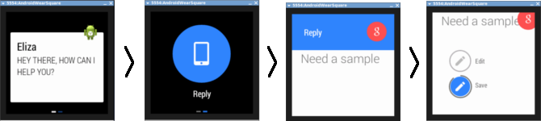

.. _begin:

What About the Sample Apps?
===========================

By: Michael Hahn, June 2014

The Android Wear SDK includes many sample applications, including the following:  

* ElizaChat
* RecipeAssistant
* WearableNotificationsSample

Open and Launch an Example App
-------------------------------

This section explains how to open and run any of the sample apps. You need an Android development environment (Android Studio here), your own handheld device running the Android Wear App, and either an Android Wear device or emulator.

To launch Android Wear samples:

#. If you have not already done so, :ref:`setup`.
#. Start Android Studio.
#. Select **Open Project** from the **File** Menu.
#. Navigate to the desired sample project, select the ``gradle.build`` file, and click **OK**.
#. Verify that the project opens without errors.
#. :ref:`start` on your Android Device.
#. In Android Studio, select **Run** to install the sample app on your handheld device. When prompted to choose a device, make sure to select your handheld device, not the Android Wear emulator.

   The sample app opens on your handheld device. If you hare having problems, make sure  the Android Wear App is running and connected to the Android Wear emulator.

Try Eliza Chat
---------------

The Eliza Chat sample app shows how you might implement a Personal Digital Assistant on a wearable device. Eliza is the assistant in this example. Eliza posts responses on the wearable emulator and you enter questions by tapping a reply icon. Normally you would provide voice inputs, but that is not implemented in this sample. For now, you simply type what you have to say.

When you first launch the app, Eliza asks how she can help you.

To reply, swipe the screen to the left, select the reply icon, and then type your demand in the Reply form. Before the Eliza app accepts your demand, you choose from two options, Edit or Save. This sequence demonstrates a typical UI pattern, which consists of a notification, a reply, and a fixed choice. 
    
Eliza then responds to your question and you can continue with the dialog. The entire session is recorded on the handheld device. The following screen shows the transcript for several exchanges with Eliza.

 .. figure:: images/eliza-app2.png
    :scale: 35 %

Try Recipe Assistant
---------------------

The Recipe Assistant app is an example of a fully-functional Android application that extends it capabilities to a wearable device. On the handheld device, you can scroll through the full recipe and steps. On the wearable device you view the recipe steps one at a time on separate pages.

The app starts on the mobile device with three recipes from which to choose. Select the first one and you get the guacamole recipe.

 .. figure:: images/recipe-app1.png
    :scale: 35 %

 Click Start in the upper right corner, and the recipe is displayed on the wearable emulator.

 .. figure:: images/recipe-sequence.png

Swipe left to move through the steps. For each step you can tap to view more and swipe up or down to move through the content.

Try Wearable Notifications
---------------------------

The Wearable Notifications sample app provides a simple way to try out different combinations of wearable UI notifications and patterns. The onscreen choices closely match the capabilities of the ``WearableNotifications`` class, so this is a good opportunity to learn about available displays. Later we will experiment with the underlying code.

  .. figure:: images/example-notify.png
    :scale: 35 %

The UI is basically a smorgasbord of wearable notification possibilities. The best way to use this app is simply to try out all the choices. You can select a basic notification type (preset), set its priority, and attach action icons.  You can also include a background image that provides context for the text notification.

Unlike a conventional Android app, you cannot define your own layout for a wearable device. Instead, you work with the presets that are available. We expect more capabilities however as new wearable APIs become available.