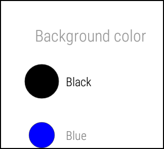

.. _begin:

What About the Sample Apps?
===========================

By Michael Hahn, December 2014

Google provides a variety of sample applications for wearables that demonstrate the basic capabilities of Android Wear.  All are Android Studio projects that you can download, compile, and run on a wearable. This section provides an introduction to the following examples.

* Watchface
* ElizaChat
* RecipeAssistant
* Notifications

Open a Sample Project in Android Studio
----------------------------------------

#. If you have not already done so, :ref:`setup`.
#. Start Android Studio. The Welcome screen is displayed.
#. Select **Import an Android code sample** from the Quick Start panel. The Browse Samples page is displayed.
#. Select the desired sample from the list of samples.
#. Click **Next**. The Sample Setup page is displayed.
#. Accept the defaults and click **Finish**.
#. Verify that the project opens without errors. Sometimes you need to install or update sdk packages.
#. Start the Android Wear companion app on your Android handheld, if necessary.

Launch the Sample App or Service
---------------------------------

Handheld Code
^^^^^^^^^^^^^^

#. Select **Application** in the toolbar.
#. Select **Run**. If the sample has a default Activity, it is started.
#. If the sample does not have a default activity, the Run/Debug Configuration dialog is displayed. Select **Do Not Launch Activity**, then click **OK**. 
#. When prompted to choose a device, select your handheld device and click **OK**.
#. Wait for the Application to fully compile and start.

Wearable Code
^^^^^^^^^^^^^^
If the sample has Wearable code perform these steps.

#. Select **Wearable** in the toolbar.
#. Select **Run**. If the wearable has a default Activity, it is started.
#. If the Wearable does not have a default activity, the Run/Debug Configuration dialog is displayed. Select **Do Not Launch Activity**, then click **OK**. 
#. When prompted to choose a device, select your wearable device and click **OK**.

Try the Watchface Sample
-------------------------

This sample installs six watch face samples. These include a variety of analog and digital time displays, including full-screen displays of the current time and split-screen displays of time and timely information. These samples are a starting point for developers interested in creating innovative new watch faces.

The watch face sample consists of services only; it is not an application that you can launch from an icon. On the handheld, you view the sample watch faces in the opening page of the Android Wear companion app. 

On the wearable, you view the sample watch faces in Settings, under the Change Watch Face. In the small screen, you must scroll through them one at at time.

On both the handheld and wearable, watch faces display a gear icon if they have customizable settings. In the Android Wear companion app, selecting the sample digital watch face displays the following choices:

On the wearable, you can only choose a background color when you select the icon:

Try Eliza Chat
---------------

The Eliza Chat sample app shows how you might implement a Personal Digital Assistant on a wearable device. Eliza is the assistant in this example. Eliza posts responses on the wearable emulator and you enter questions by tapping a reply icon. Normally you would provide voice inputs, but that is not implemented in this sample. For now, you simply type what you have to say.

When you first launch the app, Eliza asks how she can help you.

To reply, swipe the screen to the left, select the reply icon, and then type your demand in the Reply form. Before the Eliza app accepts your demand, you choose from two options, Edit or Save. This sequence demonstrates a typical UI pattern, which consists of a notification, a reply, and a fixed choice. 
    
Eliza then responds to your question and you can continue with the dialog. The entire session is recorded on the handheld device. The following screen shows the transcript for several exchanges with Eliza.

 .. figure:: images/eliza-app2.png
    :scale: 35 %

Try Recipe Assistant
---------------------

The Recipe Assistant app is an example of a fully-functional Android application that extends it capabilities to a wearable device. On the handheld device, you can scroll through the full recipe and steps. On the wearable device you view the recipe steps one at a time on separate pages.

The app starts on the mobile device with three recipes from which to choose. Select the first one and you get the guacamole recipe.

 .. figure:: images/recipe-app1.png
    :scale: 35 %

 Click Start in the upper right corner, and the recipe is displayed on the wearable emulator.

 .. figure:: images/recipe-sequence.png

Swipe left to move through the steps. For each step you can tap to view more and swipe up or down to move through the content.

Try Wearable Notifications
---------------------------

The Wearable Notifications sample app provides a simple way to try out different combinations of wearable UI notifications and patterns. The onscreen choices closely match the capabilities of the ``WearableNotifications`` class, so this is a good opportunity to learn about available displays. Later we will experiment with the underlying code.

  .. figure:: images/example-notify.png
    :scale: 35 %

The UI is basically a smorgasbord of wearable notification possibilities. The best way to use this app is simply to try out all the choices. You can select a basic notification type (preset), set its priority, and attach action icons.  You can also include a background image that provides context for the text notification. The Android Wear app is another way to view different notification examples. The  examples in the app are based on use cases, like traffic, weather, and sports, rather than underlying API options like Big Screen and Big Text.
