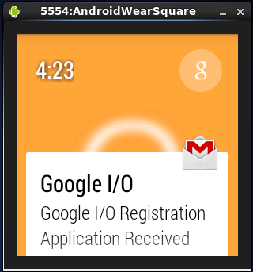

********************
Android Wear Suggest
********************

The Suggest context stream is one of the core functions for Android Wear. It consists of a sequence of displays about timely information, such as incoming messages. 

The Android Wear Preview app demonstrates this core function by displaying new messages when they arrive. You can swipe to the right to discard the message, or swipe to the left to scroll through the demands you can make, such as open, reply, or archive.

