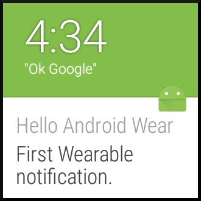

Android Wear Suggest
====================

By Michael Hahn, November 2015

The Suggest context stream is one of the core functions for Android Wear. It consists of a sequence of notifications about timely information, such as incoming messages or upcoming appointments. It can also display useful information about a task at hand, such as preparing a recipe or communicating with a digital assistant.

 .. figure:: images/suggest-notify.png
    :scale: 35
    :align: right

This section explains how to display your own custom notifications on a wearable device. The easiest way is to create a normal Notification, initialize it with your custom message, and send it using the NotificationManager. These notifications are displayed on both the handheld device and wearable emulator with a similar level of detail.

 .. figure:: images/suggest-big-picture.png
    :scale: 35
    :align: right

Normal text notifications are only the beginning however. Android 4.1 introduced three additional styles: Big Picture, Big Text, and Inbox. The big picture example demonstrates one way to add a contextual image to the notification.

 .. figure:: images/suggest-email.png
    :scale: 35
    :align: right

Android Wear adds even more styles that improve the user experience on the small screen of a wearable device. These styles make it possible to group or add pages to notifications. The email example shows how messages are grouped to reduce the number of notification delivered to a wearable.

You do not have to rely any of these stock UI styles. You can create your own full-screen layout that best suits your custom wearable application. Just keep it simple and be consistent in presentation and usage with other wearable displays. For example, do not try to replicate the grid layout of the handheld device - the wearable is just too small for this approach. Users just glance at their watch, speak simple commands, or tap and swipe the screen.

First Android Wear Suggest
---------------------------

This section explains how to create your first Android Wear notification and add it to the Suggest context stream on an Android wearable, or emulator. The new project wizard in Android Studio creates a project with two main activities, one for the handheld device and another for the wearable. To create your first suggest notification, add code in the handheld activity only, located in the "mobile" branch of the project hierarchy. The preinstalled software on a wearable device or emulator handles the task of receiving and displaying notifications from the handheld.

.. _newapp:

Create a Project
^^^^^^^^^^^^^^^^^

This section explains how to create a new project using Android Studio Version 1. If you have an earlier version, update it before starting this procedure.

1. Launch Android Studio.

2. Select **Start a New Android Studio Project** in the Welcome screen.

3. In the new project dialog, enter your Application Name, Domain, and a project directory. Click **Next**.

4. In the target devices dialog, select **Phone and Tablet** only. Accept the default **Minimum SDK** unless you are testing with a device that requires an earlier version. Click **Next**.
 
5. In the Add an Activity to Mobil dialog, select **Blank Activity**. Click **Next**.

6. In the Customize the Activity dialog,  enter an Activity Name that suggests the purpose of the activity, like SuggestActivity. Accept default values for the other fields and click **Next**.

Modify the Handheld Activity
^^^^^^^^^^^^^^^^^^^^^^^^^^^^^

1.  Verify that the build.gradle (Module: app) file includes the following dependencies:

  .. code-block:: java
   
    compile 'com.android.support:appcompat-v7:23.1.0'
    compile 'com.android.support:design:23.1.0'

2. Add Android Wearable features to a Wearable extender object, for example HintShowBackgroundOnly, to the onCreate method.

  .. code-block:: java
  
    NotificationCompat.WearableExtender wearableExtender =
      new NotificationCompat.WearableExtender()
          .setHintShowBackgroundOnly(true);

3. Create a normal Android notification using the NotificationCompat.Builder and set desired properties, including those defined in the WearableExtender.

  .. code-block:: java
	  
    Notification notification =
      new NotificationCompat.Builder(this)
         .setSmallIcon(R.drawable.ic_launcher)
          .setContentTitle("Hello Android Wear")
          .setContentText("First Wearable notification.")
          .extend(wearableExtender)
          .build();

4. Create a graphic for the notification by copying the ic_launcher.png (hdpi) icon from the mipmap folder to the drawable folder. 
 
5. Optionally, apply a release 4.1 style to the normal notification, such as the one used in the Big Picture example (NotificationCompat.BigPictureStyle).

6. Get an instance of the Notification Manager service.

  .. code-block:: java

    NotificationManagerCompat notificationManager =
        NotificationManagerCompat.from(this);

7. Dispatch the notification. 

  .. code-block:: java
   
    int notificationId = 1;
    notificationManager.notify(notificationId, notification);

This app creates a notification that is sent to both the handheld and wearable. If necessary on the wearable, scroll through other notifications to view this one. The Hello World displayed on the handheld screen is part of the default app created by the new project wizard.

The basic Suggest functionality on a wearable is handled entirely by its default system software; no custom wearable app is required. 

Example
--------

The full Android Studio project for this example is posted at https://github.com/LarkspurCA/WearableSuggest.

